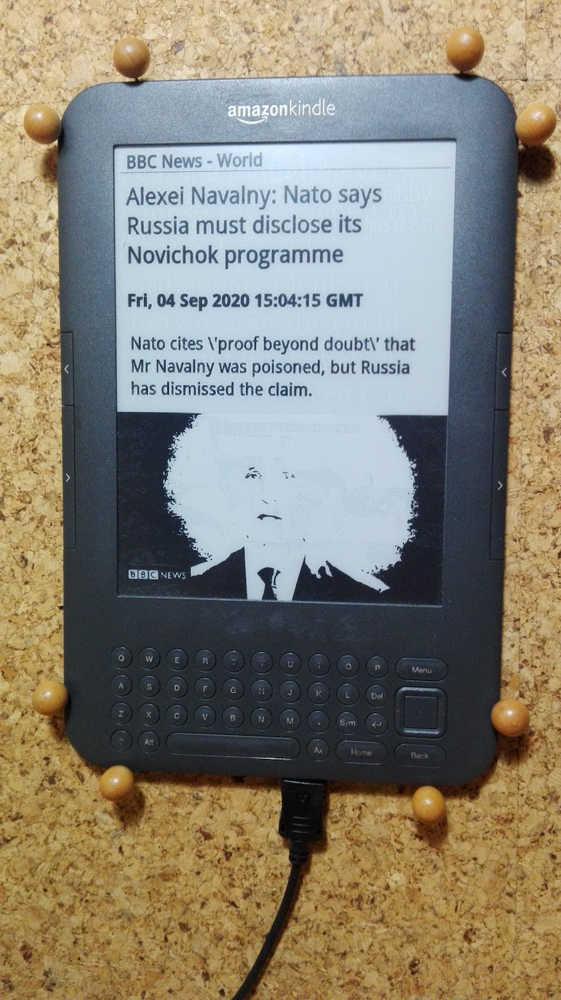

# kindle-news-feeds-display
 
This repo is display bbc news feeds on old kindle 3

### Screenshot


## Setup
### kindle
1. jailbreak your Kindle
2. copy kindle/kindle-weather to /mnt/us folder
3. setup cron
5. setup usbnet: rename to /mnt/us/usbnet/auto
4. optionally install kindle-debian, system can improve

### server
1. get free subscription plan from openweathermap.org
2. setup usbnet
3. copy host-server/var/lib/kindle-weather-host to /var/lib folder
4. install packages and setup (eg. debian buster)
5. install python3 modules: feedparser, requests, lxml
6. setup font
7. setup cron

```
    usbnet: /etc/network/interfaces
    
    auto usb0
      iface usb0 inet static
      address 192.168.2.1
      netmask 255.255.255.0
      broadcast 192.168.2.255
      network 192.168.2.0

    image processors:
    apt install imagemagick imagemagick-6-common imagemagick-6.q16 \
      imagemagick-common libgraphicsmagick-q16-3 libmagickcore-6.q16-6 \
      libmagickcore-6.q16-6-extra libmagickwand-6.q16-6 pngcrush potrace
potrace
    web server:
    apt install nginx-light

    firewall:
    apt install shorewall
    
    ntp server:
    apt install ntp

    font:
    apt install fontconfig

    exract archive and copy ttf font to /root/.fonts folder
    fc-cache -v -f
```

## setting
Edit settings.xml
